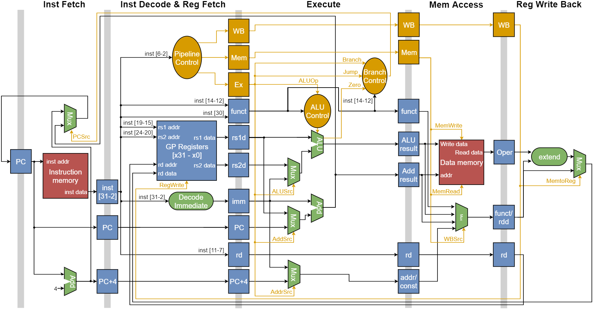
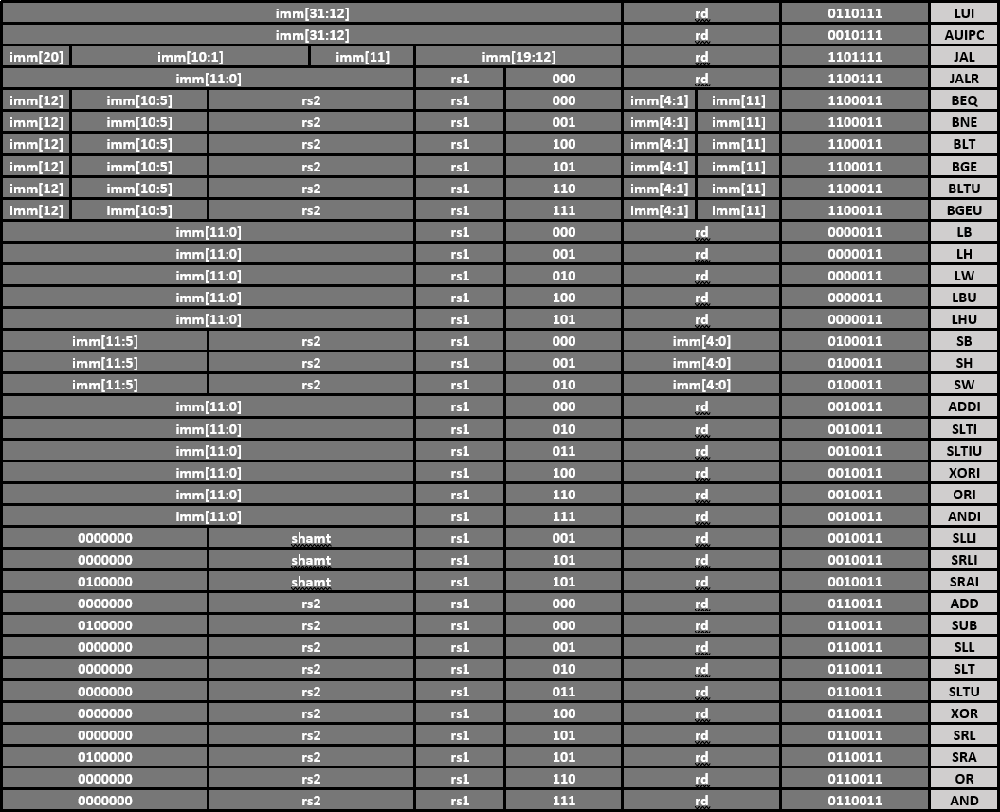

# CREEMcore32U
The CREEMcore32U is a soft RISC-V core, designed from the ground up, to be used as an educational tool in computer architecture and organisation. The VHDL implemtation, is simple by design and, in conjunction with the [dissertation](/docs/Dissertation.pdf) aims to be a suitable introduction to many common microarchitecture techniques for beginers. A more detailed overview of this project can be found in the [poster](/docs/Poster.pdf)

## Features
* Classic five-stage RISC pipeline
* Byte aligned memory that supports misaligned access
* Supports a subset of the RV32I version 2.0 instruction set

## Future Enhancements
1. Improvments to pass timing simulation
2. Testing on a FPGA
3. Support the full RV32I version 2.0 instruction set